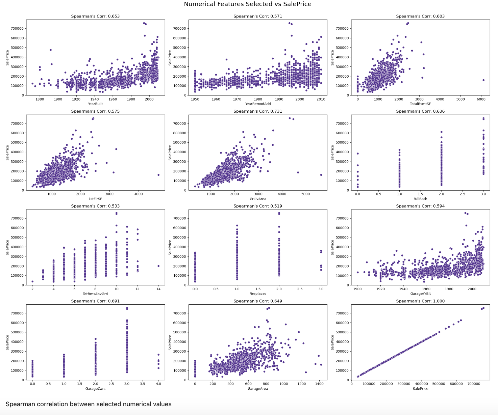

# Final_Project

Module 21- First Segment Project Deliverable 

## Team Name:

Eyes to Analyze 
* Derek Hypolite
* Felipe Lastra 
* Aderonke Adegbite
* Clemance Khalaf

## Purpose

The purpose of this analysis is to predict the potential sale price, in US Dollars, of 1,459 homes located in Ames, Iowa based on 79 categorical and numerical variables that describe different aspects of each house. The dataset, along with the approach for this analysis, derive from a Kaggle competition titled "[House Prices - Advanced Regression Techniques](https://www.kaggle.com/competitions/house-prices-advanced-regression-techniques)". 

The Kaggle competition provided a "training dataset" that already includes a Sale Price for each home that will be used to train the machine learning model; said model will be used to make predictions on the observations contained in the "test dataset".

Based on the provided data, the team will perform an Exploratory Data Analysis and select the relevant variables in order to determine which machine learning model would result more accurate to predict the potential sale price of each home. 

## Exploratory Data Analysis

Both train and test datasets contain 79 variables plus the Sale Price variable that is provided in the training dataset and will be calculated for the test dataset. Of the 79 independent variables, 43 are numerical and 36 are categoricas.

### Target variable: Sale Price

To better understand the variable that we aim to predict, a brief analysis was performed in the SalePrice variable provided in the train dataset. 

From the previous plots, we can observe that the distribution of target variable is positively skewed and observes kurtosis of 6.53, thus target variable is not normally distributed. The presence of outliers is noted as well.

In order to determine if the target variable can be transformed to obtain a normal distribution that may facilitate the analaysis, a logarithmic transformation was performed, obtaining the following results: 

The new variable shows skewness of 0.12 and a kurtosis of 0.80, thus normal distribution could be assumed. 

## Summary

For our final project we decided to take a dataset from a Kaggle.com competition on House Prices. The purpose of the competition is to predict the final price of each home. We chose this dataset and competition due to our shared interest in finances and housing prices. The housing market is always a controversial topic with predictions being made everyday of whether housing prices will crash like it did in 2008. Currently, high mortgage prices haunt our home owners which will slow down the housing market. The goal of our project is to predict the housing prices for Ames, Iowa. We seek to answer the following questions: 

* What variables best describe the target variable (sale price)?

Test used: 

* We are thinking of using random forest and gradiant boosting to answer the above question. 

## Tools Used

We will be using: 
 * Jupyter Notebook
 * Python

## Dataset/Kaggle Website:

https://www.kaggle.com/competitions/house-prices-advanced-regression-techniques/overview

## Description of the Data
* train.csv - the training set
* test.csv - the test set
* data_description.txt - full description of each column, originally prepared by Dean De Cock but lightly edited to match the column names used here
* sample_submission.csv - a benchmark submission from a linear regression on year and month of sale, lot square footage, and number of bedrooms

## Project Status

Our team worked with large datasets. Each dataset contained about 80+ columns of variables. We worked first to import, sort and clean the data. Once we removed missing variables, we created a new dataset to begin the machine learning process. The team used Random Forest to answer our project question. Team members created two machine learning trials in case the first one was unsuccessful. 

## Results 

### Sales Price Distribution

### Spearman Correlation

### Numerical Features Selected versus SalesPrice

## Overall Summary

