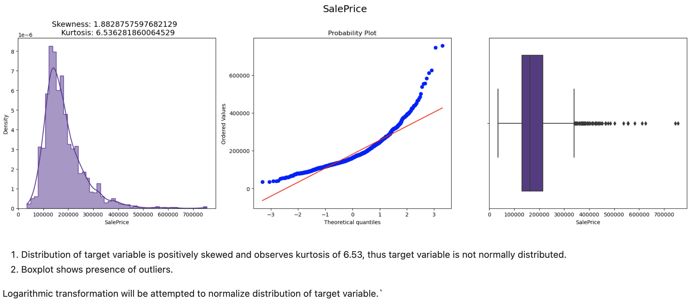
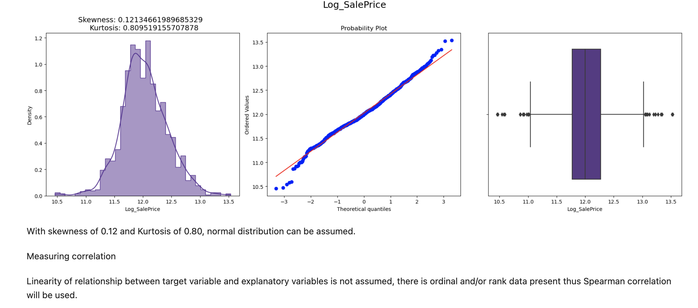
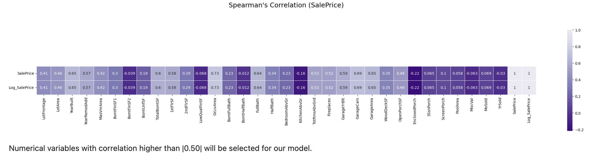

# Final_Project

Module 21- First Segment Project Deliverable 

## Team Name:

Eyes to Analyze 
* Derek Hypolite
* Felipe Lastra 
* Aderonke Adegbite
* Clemance Khalaf

## Summary

For our final project we decided to take a dataset from a Kaggle.com competition on House Prices. The purpose of the competition is to predict the final price of each home. We chose this dataset and competition due to our shared interest in finances and housing prices. The housing market is always a controversial topic with predictions being made everyday of whether housing prices will crash like it did in 2008. Currently, high mortgage prices haunt our home owners which will slow down the housing market. The goal of our project is to predict the housing prices for Ames, Iowa. We seek to answer the following questions: 

* What variables best describe the target variable (sale price)?

Test used: 

* We are thinking of using random forest and gradiant boosting to answer the above question. 

## Tools Used

We will be using: 
 * Jupyter Notebook
 * Python

## Dataset/Kaggle Website:

https://www.kaggle.com/competitions/house-prices-advanced-regression-techniques/overview

## Description of the Data
* train.csv - the training set
* test.csv - the test set
* data_description.txt - full description of each column, originally prepared by Dean De Cock but lightly edited to match the column names used here
* sample_submission.csv - a benchmark submission from a linear regression on year and month of sale, lot square footage, and number of bedrooms

## Project Status

Our team worked with large datasets. Each dataset contained about 80+ columns of variables. We worked first to import, sort and clean the data. Once we removed missing variables, we created a new dataset to begin the machine learning process. The team used Random Forest to answer our project question. Team members created two machine learning trials in case the first one was unsuccessful. 

## Results 

### Sales Price Distribution

### Linearity of Relationship

### Spearman Correlation

## Overall Summary

