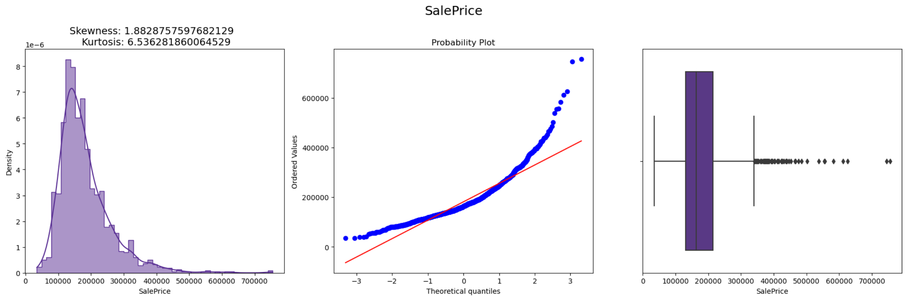
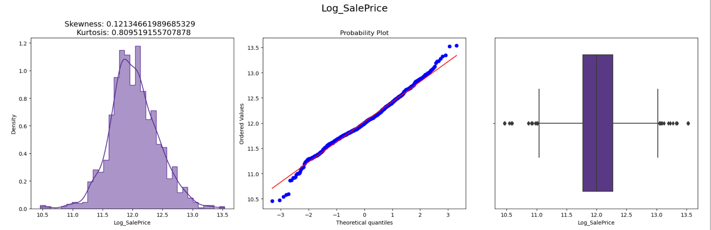
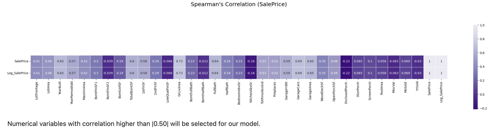
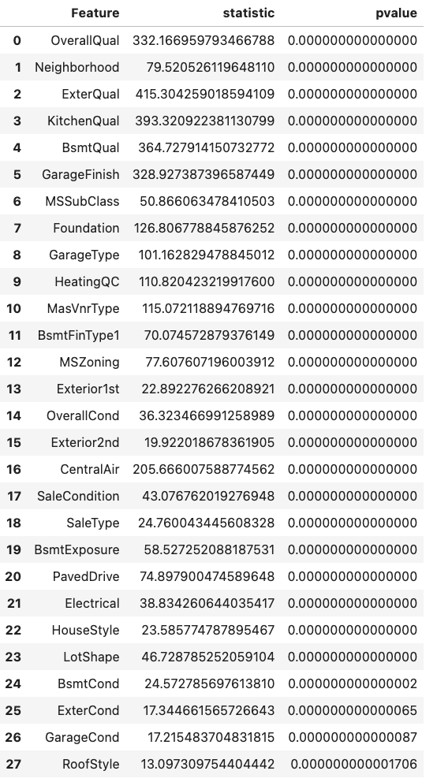

# Final_Project

Module 21- First Segment Project Deliverable 

## Team Name:

Eyes to Analyze 
* Derek Hypolite
* Felipe Lastra 
* Aderonke Adegbite
* Clemance Khalaf

## Purpose

The purpose of this analysis is to predict the potential sale price, in US Dollars, of 1,459 homes located in Ames, Iowa based on 79 categorical and numerical variables that describe different aspects of each house. The dataset, along with the approach for this analysis, derive from a Kaggle competition titled "[House Prices - Advanced Regression Techniques](https://www.kaggle.com/competitions/house-prices-advanced-regression-techniques)". 

The Kaggle competition provided a "training dataset" that already includes a Sale Price for each home that will be used to train the machine learning model; said model will be used to make predictions on the observations contained in the "test dataset".

Based on the provided data, the team will perform an Exploratory Data Analysis and select the relevant variables in order to determine which machine learning model would result more accurate to predict the potential sale price of each home. 

## Exploratory Data Analysis

Both train and test datasets contain 79 variables plus the Sale Price variable that is provided in the training dataset and will be calculated for the test dataset. Of the 79 independent variables, 43 are numerical and 36 are categoricas.

### Target variable: Sale Price

To better understand the variable that we aim to predict, a brief analysis was performed in the SalePrice variable provided in the train dataset. 

From the previous plots, we can observe that the distribution of target variable is positively skewed and observes kurtosis of 6.53, thus target variable is not normally distributed. The presence of outliers is noted as well.

In order to determine if the target variable can be transformed to obtain a normal distribution that may facilitate the analaysis, a logarithmic transformation was performed, obtaining the following results: 

The new variable shows skewness of 0.12 and a kurtosis of 0.80, thus normal distribution could be assumed. 

### House features 

As it was mentioned earlier, the provided datasets have both categorical and numerical features. A correlation analysisi will be performed on numerical variables and an analysis of variance will be performed on the categorical ones. 

#### Correlation Analysis

The chart above shows that the numerical features with the highest spearman correlation coefficient are the following: 

 *'YearBuilt'
 *'YearRemodAdd'
 *'TotalBsmtSF'
 *'1stFlrSF'
 *'GrLivArea'
 *'FullBath'
 *'TotRmsAbvGrd'
 *'Fireplaces'
 *'GarageYrBlt'
 *'GarageCars'
 *'GarageArea'
 *'SalePrice'
 *'Log_SalePrice'

#### Analysis of Variance

The above table displays the categorical variables that observed a p-value of above 0.05, thus being statistically significant. 

## Model Selection

Based on the analyzded data, it was determined that the machine learning models that would more accurately predict the Sale Price for the provided data would be:

*A) Random Forest Regression (RFR)
*B) Gradient Boosting (GB)

Because our data was not nornally distributed, it was decided that a non-parametric model such as RFR would result optimal. GB as was also selected to to its ability to minimize data loss. 

 

## Results 

